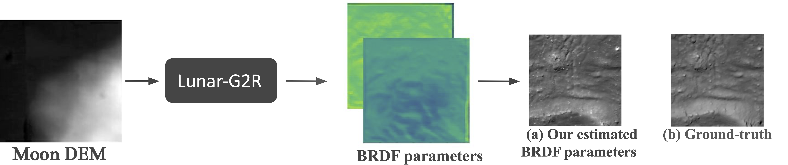
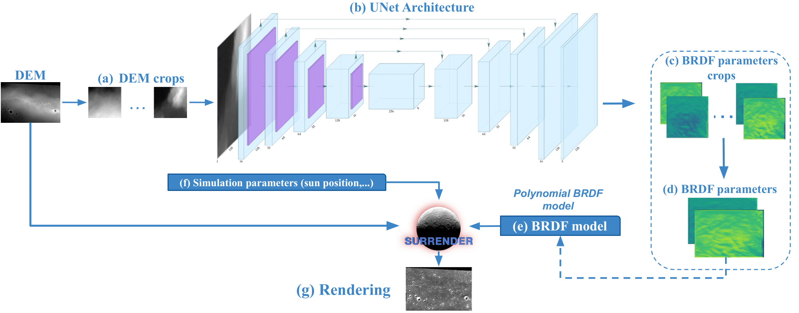
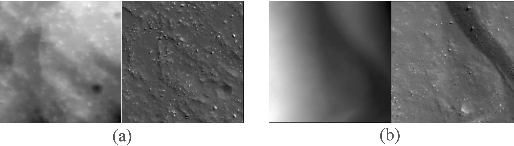

# Lunar-G2R
Official implementation of **Lunar-G2R: Geometry-to-Reflectance Learning for High-Fidelity Lunar BRDF Estimation**
 


## Overview

High-fidelity rendering of lunar surfaces is essential for simulation, perception, and vision-based navigation (VBN), yet current pipelines often rely on simplified or spatially uniform reflectance models (e.g., Hapke).  
We introduce **Lunar-G2R**, a neural framework that estimates **spatially varying BRDF parameters directly from lunar digital elevation models (DEMs)**. The predicted per-pixel reflectance maps enable physically based renderings that more closely match real orbital observations than classical analytical models.  
Lunar-G2R is trained using real lunar imagery through a differentiable rendering formulation, allowing reflectance to be learned from geometry alone.

## Table of Contents

- [News](#news)
- [Repository Structure](#repository-structure)
- [Architecture](#architecture)
- [Checkpoints](#checkpoints)
- [Training Dataset](#training-dataset)
- [Re-training on New Lunar Models](#re-training-on-new-lunar-models)
- [Citation](#citation)
- [Acknowledgements](#acknowledgements)

## News

- January 2026: Code release.

## Repository Structure
``` 
Lunar-G2R/
├── BRDFGenerator/
│  ├── data/
│  │   └── best-model-parameters-val_loss.pt
│  ├── models/
│  ├── inference/
│  └── utils/
├── ImageSimulator/
│  ├── surrender_pipeline/
│  └── rendering_utils/
├── src/
│  ├── training/
│  ├── evaluation/
│  ├── dataset_construction/
│  └── metrics/
├── assets/
│  ├── teasing.png
│  ├── inference.png
│  └── dataset.png
└── readme.md
``` 
## Architecture

For BRDF maps prediction: use BRDFGenerator, don't need to install surrender

To use BRDF maps for image rendering: use ImageSimulator, need to install surrender (or developp your own ray tracing method)

To have access to DEM-Orthoimages pairs : follow Zenodo link

To have access to the best model described in the paper: see /checkpoints --> weight, training configuration, test/val/train repartition

To train/eval/Create dataset on other DEM: follow src/brdfgen (You need to adapt the code for your own project + install surrender for differentiable rendering! )


### BRDFGenerator

[BRDFGenerator](BRDFGenerator/) (BRDFGenerator/) contains the network used to predict spatial BRDF parameter maps from DEM patches. 

- Input: DEM patches (128 x 128 pixels)
- Output: per-pixel BRDF parameters for a low-order polynomial BRDF model (3 parameters)
- Training region: Tycho crater
- Ground sampling distance: 5 m/px
 - Ground sampling distance: 5 m/px


(No need of surrender for this part)


After training, the model can be applied to any DEM patch to infer reflectance parameters, enabling BRDF-aware image synthesis without photometric inputs.

### ImageSimulator

[ImageSimulator](ImageSimulator/) regroupe des utilitaires pour le rendu physiquement basé (voir détails ci-dessous).
- DEM geometry
- predicted BRDF parameter maps
- illumination geometry (Sun direction)
- viewing geometry (camera pose)

Rendering relies on **SurRender** (Airbus Defence and Space), a physically based ray-tracing engine widely used in space applications.

Note: SurRender is available for academic purpose. Users without access can implement their own ray-tracing pipeline or use the predicted BRDF maps independently within other simulation frameworks.

### src

`src` contains:
- training, validation, and testing scripts
- dataset construction utilities
- evaluation metrics used in the paper

The full-resolution Tycho DEM used for training and evaluation is not publicly distributable, as it was obtained through Airbus / Pixel Factory.
Access to the complete Tycho DEM is therefore required to fully reproduce the experiments reported in the paper.

Nevertheless, the training dataset released with this repository (made with the full Tycho DEM) is public and sufficient to reproduce the methodology and extend the proposed approach.
In particular, the provided codebase can be directly applied to conduct similar studies on other lunar regions, using alternative DEMs for which both geometry and LRO-based textures are available.

At this stage, we cannot guarantee whether the full Tycho DEM will be made publicly available in the future.
## Checkpoints

Pre-trained checkpoint for the 3-parameter polynomial BRDF model:
This checkpoint corresponds to the model reported in the paper and can be used directly for inference.
Train/val/tets repartition of the Zenodo dataset +  metadata used in this configuration (output of src/brdfgen/train.py)
## Training Dataset

We release the Lunar-G2R training dataset, which can also serve other computer vision and planetary perception studies.



Dataset characteristics:
- 83,614 DEM-image pairs
- Patch size: 128 x 128 pixels
- Ground sampling distance: 5 m/px
- Region: Tycho crater

Split:
- 66,662 training samples
- 8,615 validation samples
- 8,337 test samples

Each sample includes:
- a DEM patch
- an orthorectified LRO image
- acquisition metadata (Sun direction, viewing geometry, camera parameters, georeferencing)

## Re-training on New Lunar Models

Although the exact Tycho DEM used in the paper cannot be redistributed, the full training pipeline is available and can be used for other task or other part of the Moon.
Check src (src/) folder!
Using:
- a new lunar DEM
- real or simulated imagery
- the provided dataset construction scripts
- a differentiable renderer (e.g., SurRender)

users can retrain Lunar-G2R on new lunar regions or adapt the method to other planetary bodies.

## Citation

If you find our work useful, please consider citing:

```bibtex
@misc{grethen2026lunarg2rgeometrytoreflectancelearninghighfidelity,
      title={Lunar-G2R: Geometry-to-Reflectance Learning for High-Fidelity Lunar BRDF Estimation}, 
      author={Clementine Grethen and Nicolas Menga and Roland Brochard and Geraldine Morin and Simone Gasparini and Jeremy Lebreton and Manuel Sanchez Gestido},
      year={2026},
      eprint={2601.10449},
      archivePrefix={arXiv},
      primaryClass={cs.CV},
      url={https://arxiv.org/abs/2601.10449}, 
} 
```

## Acknowledgements 

This work was supported by the European Space Agency (ESA) under contract 4000140461/23/NL/GLC/my.
